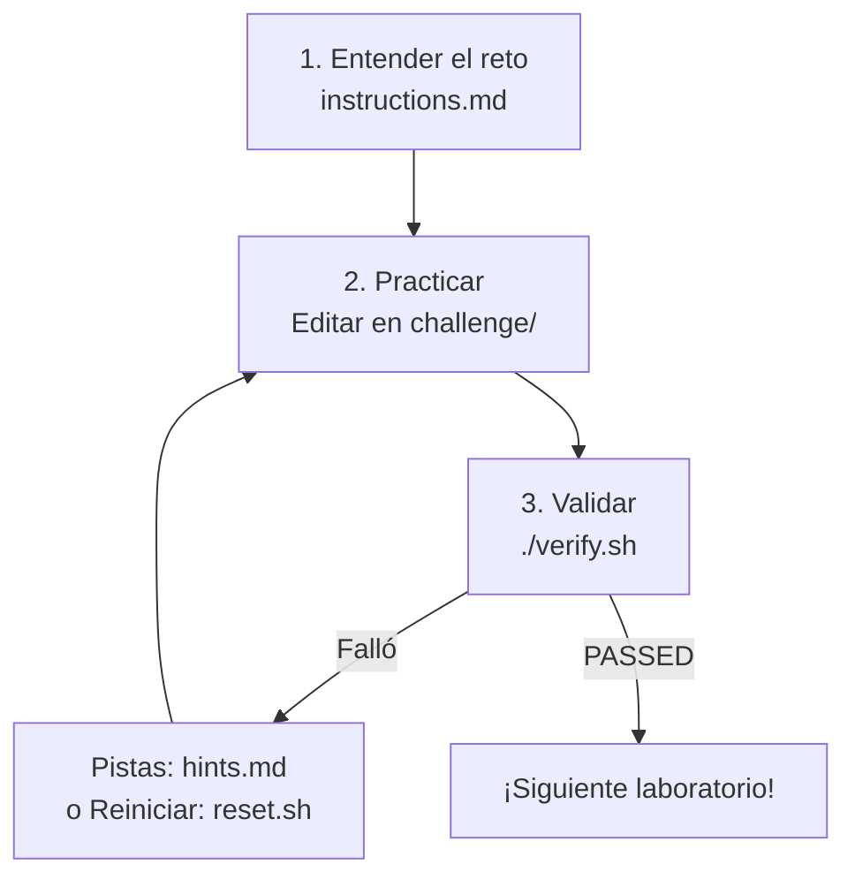

<div align="center">
<pre>
███████╗██╗  ██╗██████╗  ██████╗  ██████╗    ███████╗██╗      ██████╗ ██╗    ██╗ 
██╔════╝╚██╗██╔╝╚════██╗██╔═══██╗██╔═══██╗    ██╔════╝██║     ██╔═══██╗██║    ██║
█████╗   ╚███╔╝  █████╔╝██║   ██║██║   ██║    █████╗  ██║     ██║   ██║██║ █╗ ██║
██╔══╝   ██╔██╗ ██╔═══╝ ██║   ██║██║   ██║    ██╔══╝  ██║     ██║   ██║██║███╗██║
███████╗██╔╝ ██╗███████╗╚██████╔╝╚██████╔╝    ██║     ███████╗╚██████╔╝╚███╔███╔╝
╚══════╝╚═╝  ╚═╝╚══════╝ ╚═════╝  ╚═════╝    ╚═╝     ╚══════╝ ╚═════╝  ╚══╝╚══╝  
                        ██╗      ██████╗ ██████╗ ███████╗                        
                        ██║     ██╔══██╗██╔══██╗██╔════╝                         
                        ██║     ███████║██████╔╝███████╗                         
                        ██║     ██╔══██║██╔══██╗╚════██║                         
                        ███████╗██║  ██║██████╔╝███████║                         
                        ╚══════╝╚═╝  ╚═╝╚═════╝ ╚══════╝                         
</pre>
</div>

<p align="center">
  <a href="https://www.redhat.com/en/services/training/ex200-red-hat-certified-system-administrator-rhcsa-exam">
    
  </a>
  <a href="https://almalinux.org/">
    
  </a>
  <a href="https://www.vagrantup.com/">
    
  </a>
  
  
  <a href="https://opensource.org/licenses/MIT">
    
  </a>
</p>

> **"Con los comandos en la shell, pasar el EX200 se vuelve un nivel fácil de vencer."**

Entorno de laboratorios **prácticos y automatizados** en español para preparar y aprobar el examen **Red Hat Certified System Administrator (RHCSA EX200)** sobre **RHEL 10 / AlmaLinux 10**.

Este repositorio proporciona **14 laboratorios** listos para usar con **Vagrant** (Hyper-V, VirtualBox o libvirt/KVM) **completamente actualizados y alineados al 99.9% con los objetivos del EX200 para RHEL 10 / AlmaLinux 10**. Cada laboratorio incluye instrucciones claras, un validador automático, reset y pistas progresivas. Se ha realizado una pasada profunda sistemática para máxima cobertura de objetivos oficiales.

**Enfoque principal de este README**: cómo desplegar el entorno de laboratorios de forma rápida y confiable.

---

## 🚀 Quickstart (5-10 minutos)

Sigue estos pasos para tener tu primera máquina virtual lista y poder comenzar cualquier laboratorio.

### 1. Clona el repositorio

```bash
git clone https://github.com/hooperits/ex200-flow-labs.git
cd ex200-flow-labs
```

### 2. Instala Vagrant + proveedor de virtualización

- **Windows**: Instala [Vagrant](https://www.vagrantup.com/downloads) + activa Hyper-V o instala VirtualBox.
- **macOS**: `brew install --cask vagrant virtualbox` (o usa UTM + libvirt si prefieres).
- **Linux**: `sudo dnf install -y vagrant` o usa tu gestor de paquetes + VirtualBox o `vagrant-libvirt`.

### 3. Levanta la máquina virtual

```powershell
# Windows (PowerShell como Administrador recomendado para Hyper-V)
vagrant up --provider=hyperv

# macOS / Linux con VirtualBox (recomendado para la mayoría)
vagrant up --provider=virtualbox

# Linux con KVM/libvirt
vagrant up --provider=libvirt
```

> [!IMPORTANT]
> Durante el primer `vagrant up` con Hyper-V se te pedirá elegir un **Virtual Switch**. Selecciona **Default Switch**.

> [!NOTE]
> **Hyper-V**: Los laboratorios ahora usan un disco duro virtual interno (sin SMB para /labs). No se requiere el usuario `vagrantlabs` para las labs (ver detalles en la guía de despliegue).

### 4. Accede a la VM y verifica

```powershell
vagrant ssh
```

Dentro de la VM (AlmaLinux 10):

```bash
ls /labs                  # Verás los 14 laboratorios
lsblk                     # Para labs de almacenamiento debe aparecer /dev/sdb
```

### 5. Elige un laboratorio y comienza

```bash
cd /labs/01-essential-tools
cat instructions.md       # Lee el reto
# ... realiza los cambios necesarios en el directorio challenge/ ...
./verify.sh               # Valida tu solución
```

¡Listo! Repite con cualquier otro módulo.

---

## 📋 Requisitos Previos

| Plataforma | Requisitos |
|------------|------------|
| **Windows 10/11** | Hyper-V activado **o** VirtualBox instalado. PowerShell. Git. |
| **macOS** | VirtualBox (o alternativa) + Vagrant. |
| **Linux** | VirtualBox o QEMU/KVM + `vagrant-libvirt` plugin + Vagrant. |

**Común a todos**: Conexión a internet para el primer aprovisionamiento (descarga de la box de AlmaLinux 10 + paquetes).

---

## 🖥️ Proveedores Soportados

| Proveedor     | Host recomendado       | Notas clave                                                                 | Comando recomendado                  | Dificultad inicial |
|---------------|------------------------|-----------------------------------------------------------------------------|--------------------------------------|--------------------|
| **Hyper-V**   | Windows 10/11 Pro/Enterprise | Usa disco virtual interno para /labs (sin SMB). Recomendado para integración Windows. | `vagrant up --provider=hyperv`      | Baja (después de primer setup) |
| **VirtualBox**| Windows, macOS, Linux  | Más universal. Fácil de usar. Recomendado si no estás atado a Hyper-V.     | `vagrant up --provider=virtualbox`  | Baja               |
| **libvirt**   | Linux (Fedora, Ubuntu, etc.) | Excelente rendimiento. Requiere plugin `vagrant-libvirt` y privilegios.   | `vagrant up --provider=libvirt`     | Media (setup inicial) |

**Recomendación**:
- Windows → **Hyper-V** para integración (ahora sin problemas de SMB para labs).
- Quieres máxima compatibilidad → usa **VirtualBox**.
- Linux → **libvirt** o VirtualBox.

---

## 🔧 Guía Detallada de Despliegue

<details>
<summary><strong>Windows + Hyper-V (clic para expandir)</strong></summary>

**⚠️ Hyper-V sin SMB para los laboratorios**

Los laboratorios ahora viven en un disco duro virtual interno (no en un share SMB). 

Esto elimina los problemas históricos de permisos (chmod, stat, etc.) que aparecían con SMB.

- Ya **no es necesario** crear el usuario `vagrantlabs` solo para montar las labs.
- Durante el primer `vagrant up --provider=hyperv` sigue seleccionando **Default Switch**.
- Si en el futuro usas otros shares o prefieres, puedes crear el usuario auxiliar, pero ya no es requisito para usar los laboratorios.

Ejemplo mínimo:

```powershell
vagrant up --provider=hyperv
vagrant ssh
ls /labs          # 14 laboratorios en disco interno real
lsblk | grep sdb  # disco secundario para prácticas de almacenamiento (LVM/VDO)
```

</details>

<details>
<summary><strong>macOS + VirtualBox</strong></summary>

```bash
brew install --cask virtualbox vagrant
vagrant up --provider=virtualbox
vagrant ssh
```

</details>

<details>
<summary><strong>Linux + VirtualBox o libvirt</strong></summary>

**VirtualBox** (simple):

```bash
sudo dnf install -y VirtualBox vagrant   # o equivalente en tu distro
vagrant up --provider=virtualbox
```

**libvirt/KVM**:

```bash
sudo dnf install -y vagrant vagrant-libvirt libvirt qemu
vagrant plugin install vagrant-libvirt
vagrant up --provider=libvirt
```

</details>

### Pasos comunes después de `vagrant up`

```bash
vagrant ssh
sudo dnf update -y                 # Opcional pero recomendado
ls /labs                           # 14 laboratorios listos
```

> [!TIP]
> Si editas archivos en tu máquina host (instrucciones, demos, etc.), actualiza el contenido dentro de la VM con:
> ```powershell
> # Desde el host
> vagrant provision
> ```
> El provisioner copia los cambios al disco virtual interno de /labs.

---

## ✅ Verifica que tu Entorno Está Listo

Ejecuta dentro de la VM:

```bash
# 1. ¿Existen los laboratorios? (ahora en disco duro virtual interno)
ls /labs | head -5

# 2. ¿Hay disco secundario para LVM/VDO? (sdb = prácticas de almacenamiento)
lsblk | grep sdb

# 3. ¿Están instalados paquetes básicos de los laboratorios?
rpm -q policycoreutils-python-utils autofs nfs-utils

# 4. Prueba un verificador (no destructivo)
cd /labs/01-essential-tools
./verify.sh
```

Si ves la lista de laboratorios y el disco `sdb`, estás listo. El disco de las labs (`sdc` normalmente) está montado en `/labs` como un filesystem nativo de Linux.

---

## 📚 Catálogo de Laboratorios (14 Retos)

Haz clic en **Instrucciones** para comenzar el reto de cada módulo. Usa **Pistas** si necesitas ayuda.

> **Nota**: El laboratorio de contenedores (anterior Lab 09) ha sido removido porque la gestión de contenedores con Podman ya no forma parte de los objetivos oficiales del EX200 en RHEL 10.

| #  | Laboratorio                                      | Descripción Breve                                      | Instrucciones                                      | Pistas                  |
|:--:|--------------------------------------------------|--------------------------------------------------------|----------------------------------------------------|-------------------------|
| 01 | Herramientas Esenciales                          | Enlaces, permisos octales, `grep`, redirecciones       | [Instrucciones](labs/01-essential-tools/instructions.md) | [hints.md](labs/01-essential-tools/hints.md) |
| 02 | Shell Scripting                                  | Variables, condicionales, bucles, parámetros           | [Instrucciones](labs/02-shell-scripting/instructions.md) | [hints.md](labs/02-shell-scripting/hints.md) |
| 03 | Operación del Sistema                            | systemd, targets, recuperación de contraseña (rd.break)| [Instrucciones](labs/03-operating-systems/instructions.md) | [hints.md](labs/03-operating-systems/hints.md) |
| 04 | Usuarios y Grupos                                | Cuentas, `nologin`, SGID, ACLs (`setfacl`)             | [Instrucciones](labs/04-users-groups/instructions.md) | [hints.md](labs/04-users-groups/hints.md) |
| 05 | Red, NTP y Cron                                  | Hostname, `nmcli` estático, `chronyd`, `crontab`       | [Instrucciones](labs/05-networking-services/instructions.md) | [hints.md](labs/05-networking-services/hints.md) |
| 06 | Seguridad y SELinux                              | `firewalld`, contextos, booleanos, `semanage`          | [Instrucciones](labs/06-security-selinux/instructions.md) | [hints.md](labs/06-security-selinux/hints.md) |
| 07 | Almacenamiento Local (LVM + VDO)                 | PV/VG/LV, `mkfs`, resize en caliente, VDO              | [Instrucciones](labs/07-local-storage/instructions.md) | [hints.md](labs/07-local-storage/hints.md) |
| 08 | Sistemas de Archivos y Red                       | `fstab` por UUID, NFS, Autofs                          | [Instrucciones](labs/08-filesystems-network/instructions.md) | [hints.md](labs/08-filesystems-network/hints.md) |
| 10 | Gestión de Paquetes y Repositorios               | DNF5, Flatpak, repos locales y módulos                 | [Instrucciones](labs/10-package-management/instructions.md) | [hints.md](labs/10-package-management/hints.md) |
| 11 | Logging y Journalctl                             | `journalctl`, `rsyslog`, persistencia de logs          | [Instrucciones](labs/11-logging/instructions.md) | [hints.md](labs/11-logging/hints.md) |
| 12 | SSH, Claves y Sudoers                            | `ssh-keygen`, `authorized_keys`, `sudoers.d`, sshd     | [Instrucciones](labs/12-ssh-sudoers/instructions.md) | [hints.md](labs/12-ssh-sudoers/hints.md) |
| 13 | Parámetros del Kernel y sysctl                   | `sysctl`, `/etc/sysctl.d/`, `/proc/sys`                | [Instrucciones](labs/13-kernel-sysctl/instructions.md) | [hints.md](labs/13-kernel-sysctl/hints.md) |
| 14 | Systemd Timers                                   | `.timer` + `.service`, `systemctl`, `list-timers`      | [Instrucciones](labs/14-systemd-timers/instructions.md) | [hints.md](labs/14-systemd-timers/hints.md) |
| 15 | Troubleshooting                                  | Diagnóstico de servicios, permisos, red y logs         | [Instrucciones](labs/15-troubleshooting/instructions.md) | [hints.md](labs/15-troubleshooting/hints.md) |

---

## 🔄 El Flujo de Estudio Recomendado



1. Lee el reto completo (`cat instructions.md`).
2. Realiza las tareas indicadas (normalmente dentro de `challenge/`).
3. Ejecuta `./verify.sh` (o `./verify.sh --explain` para más detalles) para autoevaluarte.
4. Si falla, consulta `hints.md` de forma progresiva o usa `reset.sh` para empezar limpio.
5. `demo.sh` sirve para ver los comandos en acción (no es obligatorio).

---

## 🛠️ Uso Diario

Dentro de la VM siempre trabajarás en `/labs`:

```bash
cd /labs/07-local-storage
./verify.sh              # Validación normal
./verify.sh --explain    # Modo explicativo (muestra sugerencias al fallar)
```

### Parámetros de los scripts

Cada laboratorio incluye tres scripts principales. Estos son los parámetros que aceptan:

| Script       | Comando                        | Parámetros soportados              | Descripción |
|--------------|--------------------------------|------------------------------------|-----------|
| `verify.sh`  | `./verify.sh`                  | `--explain`                        | Valida tu solución. Con `--explain` muestra sugerencias detalladas cuando falla una prueba. |
| `demo.sh`    | `./demo.sh`                    | `--fast`, `--video`                | Muestra los comandos en acción. `--fast` reduce pausas. `--video` está optimizado para grabación (muy rápido y limpio). |
| `reset.sh`   | `./reset.sh`                   | *(ninguno)*                        | Restaura el laboratorio a su estado inicial limpio. No acepta parámetros. |

**Notas importantes:**
- Siempre ejecuta estos scripts **dentro del directorio del laboratorio** (`cd /labs/XX-nombre-lab`).
- `demo.sh` es opcional (solo para ver ejemplos). Puedes completar los retos usando solo `instructions.md` + `hints.md`.
- Estos flags son consistentes en **todos** los laboratorios.

Desde el host puedes reprovisionar o recargar:

```powershell
vagrant provision
vagrant reload
```

---

## ❓ Resolución de Problemas Comunes (Deploy)

### No aparece el disco `/dev/sdb` (labs 07 y 08)
```powershell
vagrant reload
# o
vagrant destroy -f && vagrant up
```

### Hyper-V y montaje (SMB ya no usado para labs)
Los laboratorios usan un disco virtual interno. Si ves prompts de credenciales, es para otros shares (si aplica). La creación de `vagrantlabs` ya no es necesaria para las labs.

### `command not found` para `semanage`, `autofs`, etc.
El aprovisionamiento no terminó o no había internet. Ejecuta:
```powershell
vagrant provision
```

### Ejecuto `./verify.sh` en Windows/WSL y falla todo
**Todos los comandos y verificadores deben ejecutarse dentro de la VM** (`vagrant ssh`).

### La VM no tiene internet
Verifica que elegiste el **Default Switch** (Hyper-V) o que tu proveedor tenga NAT/configurado correctamente.

### Quiero empezar de cero un laboratorio específico
```bash
cd /labs/XX-...
./reset.sh
```

---

## 📖 Recursos Adicionales

- **Matriz de Objetivos EX200**: `docs/objective-matrix.md` — mapeo detallado de los laboratorios a los objetivos oficiales del examen.
- **Cobertura actual**: ~83% de los objetivos del EX200.
- **Documentación interna del proyecto**: Consulta `AGENTS.md` (reglas de calidad educativa).
- **Examen oficial**: [Red Hat EX200](https://www.redhat.com/en/services/training/ex200-red-hat-certified-system-administrator-rhcsa-exam)

---

## 📜 Licencia

Este proyecto está licenciado bajo la [Licencia MIT](LICENSE).

**Descargo de responsabilidad**: Este es un proyecto educativo independiente y **no está afiliado, respaldado ni aprobado por Red Hat, Inc.**  
Los nombres «Red Hat», «RHCSA», «RHEL», «EX200» y otros términos relacionados son marcas registradas de Red Hat, Inc. Su uso en este repositorio es únicamente con fines descriptivos y educativos.

---

## ⭐ ¿Te ayudó a prepararte?

Si este repositorio te sirvió para dominar los conceptos y prepararte para el RHCSA EX200:

- ⭐ **Dale una estrella** al repositorio
- Comparte tu experiencia
- Abre issues con sugerencias o errores encontrados

¡Éxito en tu examen!

---

**Proyecto mantenido con foco en calidad educativa y práctica real con comandos de RHEL 10.**
