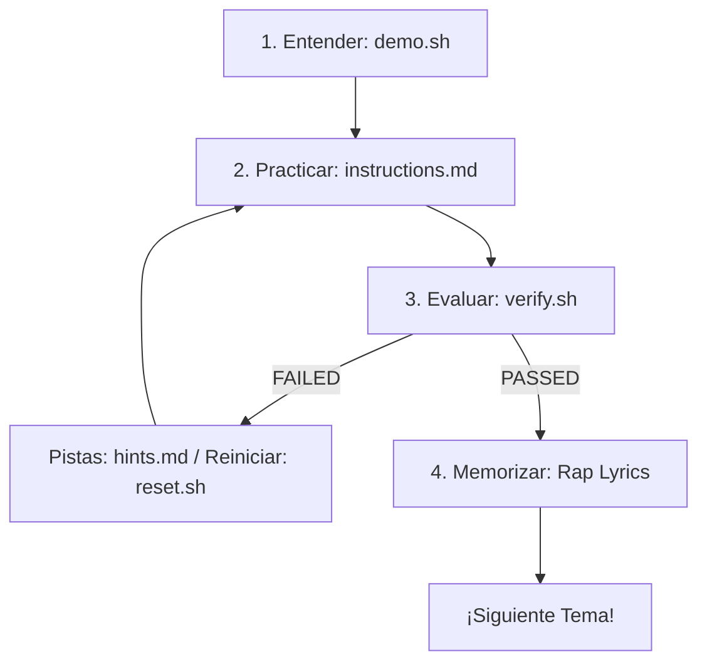

<div align="center">
<pre>
███████╗██╗  ██╗██████╗  ██████╗  ██████╗    ███████╗██╗      ██████╗ ██╗    ██╗ 
██╔════╝╚██╗██╔╝╚════██╗██╔═══██╗██╔═══██╗    ██╔════╝██║     ██╔═══██╗██║    ██║
█████╗   ╚███╔╝  █████╔╝██║   ██║██║   ██║    █████╗  ██║     ██║   ██║██║ █╗ ██║
██╔══╝   ██╔██╗ ██╔═══╝ ██║   ██║██║   ██║    ██╔══╝  ██║     ██║   ██║██║███╗██║
███████╗██╔╝ ██╗███████╗╚██████╔╝╚██████╔╝    ██║     ███████╗╚██████╔╝╚███╔███╔╝
╚══════╝╚═╝  ╚═╝╚══════╝ ╚═════╝  ╚═════╝    ╚═╝     ╚══════╝ ╚═════╝  ╚══╝╚══╝  
                        ██╗      ██████╗ ██████╗ ███████╗                        
                        ██║     ██╔══██╗██╔══██╗██╔════╝                         
                        ██║     ███████║██████╔╝███████╗                         
                        ██║     ██╔══██║██╔══██╗╚════██║                         
                        ███████╗██║  ██║██████╔╝███████║                         
                        ╚══════╝╚═╝  ╚═╝╚═════╝ ╚══════╝                         
</pre>
</div>
<p align="center">
  <a href="https://www.redhat.com/en/services/training/ex200-red-hat-certified-system-administrator-exam">
    
  </a>
  <a href="https://almalinux.org/">
    
  </a>
  <a href="https://www.vagrantup.com/">
    
  </a>
  <a href="https://github.com/github/spec-kit">
    
  </a>
</p>

> **"Con la rima en la mente y los comandos en la shell, pasar el EX200 se vuelve un nivel fácil de vencer."**

`ex200-flow-labs` es un entorno interactivo y automatizado de aprendizaje diseñado en español para dominar el examen **Red Hat Certified System Administrator (RHCSA EX200)** basado en **Red Hat Enterprise Linux 9 (RHEL 9)**. 

Este proyecto utiliza **Vagrant con Hyper-V** para ofrecer laboratorios rápidos y aislados, y añade un enfoque mnemotécnico único: **canciones de rap técnico en español** para memorizar comandos complejos y sus flags específicos de forma divertida y permanente.

---

## 📚 Temas Cubiertos en los Labs

Este entorno de laboratorios cubre el 100% de los objetivos oficiales del examen RHCSA (EX200):

1. **Herramientas Esenciales:** Consola, edición de archivos, comandos básicos y redirecciones.
2. **Scripts de Automatización:** Fundamentos y prácticas de Shell Scripting en Bash.
3. **Operación del Sistema:** Control de servicios con systemd, GRUB y recuperación de contraseña de root.
4. **Usuarios y Grupos:** Gestión de identidades, permisos especiales (SUID, SGID, Sticky Bit) y ACLs.
5. **Servicios de Red:** Configuración con nmcli, sincronización de hora con chrony y tareas programadas con Cron.
6. **Seguridad y SELinux:** Gestión de firewalld y modos, contextos y políticas de SELinux.
7. **Almacenamiento Local:** Gestión de particiones, volúmenes lógicos (LVM) y optimización.
8. **Sistemas de Archivos en Red:** Montajes estáticos en `/etc/fstab`, NFS, SMB y montajes dinámicos con Autofs.
9. **Contenedores:** Despliegue de contenedores Rootless y persistencia de servicios mediante systemd con Podman.

---

## ⚡ El Flujo de Estudio ("The Flow")

Cada laboratorio cuenta con una metodología estricta de cinco pasos estructurada bajo principios de desarrollo ágil:



1.  **`demo.sh` (La Demo Visual):** Corre el script de tutorial animado dentro de la VM para ver los comandos en acción.
2.  **`instructions.md` (El Reto):** Lee las directrices del challenge redactadas en español (pero conservando comandos en inglés).
3.  **`verify.sh` (El Validador):** Ejecuta el validador automatizado para autoevaluar tu entrega. Te dará un reporte visual de `PASSED`/`FAILED` sin alterar tus configuraciones.
4.  **`reset.sh` (El Reinicio):** ¿Cometiste un error crítico? Ejecuta el reset para limpiar la práctica y volver a empezar.
5.  **`hints.md` (Las Pistas):** Consulta pistas progresivas si te encuentras estancado.

---

## 🛠️ Configuración e Instalación Rápida (Paso a Paso)

Para que puedas correr estos laboratorios de forma local, utilizaremos un entorno nativo: **Windows 10/11** actuará como el hipervisor físico (mediante **Hyper-V**) y ejecutarás los comandos de Vagrant desde tu consola de comandos (PowerShell, CMD, o Git Bash).

Sigue esta guía narrativa sencilla para preparar tu computadora en 10 minutos:

### 1. Activar Hyper-V en tu Windows
Hyper-V es la tecnología nativa de virtualización de Windows. Necesitamos activarla:
1. Abre el menú Inicio de Windows, escribe **PowerShell**, haz clic derecho sobre él y selecciona **Ejecutar como Administrador**.
2. Copia, pega y ejecuta el siguiente comando:
   ```powershell
   Enable-WindowsOptionalFeature -Online -FeatureName Microsoft-Hyper-V -All
   ```
3. Si el sistema te solicita reiniciar para aplicar los cambios, acepta y reinicia tu equipo.

### 2. Instalar Vagrant en Windows
Vagrant es la herramienta que creará y configurará la máquina virtual por nosotros:
1. Ve al sitio oficial de descargas de [Vagrant](https://www.vagrantup.com/downloads) y descarga el instalador para Windows (arquitectura AMD64/x86_64).
2. Ejecuta el instalador descargado y sigue el asistente haciendo clic en "Next" hasta finalizar.

### 3. Configurar rsync en el PATH de Windows (Recomendado para evitar credenciales)
Por defecto, al usar Hyper-V, Vagrant intentará sincronizar las carpetas locales usando **SMB**, lo que te solicitará ingresar tu usuario y contraseña de Windows en cada arranque. Para evitar esta petición y hacer el proceso 100% silencioso y rápido:
1. Asegúrate de tener instalado [Git para Windows](https://git-scm.com/download/win).
2. Abre el menú Inicio de Windows, escribe **variables de entorno** y selecciona **Editar las variables de entorno del sistema**.
3. Haz clic en el botón **Variables de entorno...**.
4. En la sección superior ("Variables de usuario"), busca la variable llamada **`Path`**, selecciónala y haz clic en **Editar...**.
5. Haz clic en **Nuevo** y añade la siguiente ruta (donde Git instala `rsync.exe`):
   ```text
   C:\Program Files\Git\usr\bin
   ```
6. Haz clic en **Aceptar** en todas las ventanas. **Cierra todas tus terminales abiertas** y vuelve a abrir una terminal de PowerShell para que se cargue la nueva configuración.

---

## 🚀 Cómo Iniciar y Usar el Laboratorio

Una vez realizada la instalación inicial, el uso diario es sumamente rápido:

### Paso A: Clonar el proyecto
Abre la terminal de **PowerShell** en tu Windows 10/11 y clona este repositorio (requiere tener **Git** instalado en Windows) en un directorio nativo (por ejemplo, `C:\proys\`):
```powershell
git clone https://github.com/hooperits/ex200-flow-labs.git
cd ex200-flow-labs
```

### Paso B: Encender la Máquina Virtual
Inicia la máquina AlmaLinux 9 de estudio desde tu consola (PowerShell o Git Bash) con privilegios de Administrador (requerido para Hyper-V):
```powershell
vagrant up --provider=hyperv
```

> [!IMPORTANT]
> **Selección del Switch Virtual en Hyper-V**:
> Durante el arranque de la máquina virtual, Vagrant te solicitará elegir un **Virtual Switch** (Switch Virtual). 
> * **Recomendación**: Selecciona la opción correspondiente a **`Default Switch`**.
> * **Por qué**: Este switch interno de Windows viene preconfigurado con asignación de IP automática (DHCP) y traducción de red (NAT), lo que asegura que tu máquina virtual obtenga salida a Internet para el aprovisionamiento de dependencias y que Vagrant pueda comunicarse con ella vía SSH.

### Paso C: Entrar a la Máquina de Estudio y Ejecutar el Lab
1. Accede a la consola de la máquina virtual vía SSH:
   ```powershell
   vagrant ssh
   ```
2. Dentro de la máquina (que es un entorno Linux de AlmaLinux 9), navega al directorio de laboratorios `/labs/` y entra en el módulo que desees practicar (por ejemplo, el módulo 01):
   ```bash
   cd /labs/01-essential-tools/
   ```
3. Ejecuta la demostración animada con explicaciones en español para entender los conceptos:
   ```bash
   ./demo.sh
   ```
4. Lee las instrucciones del reto práctico:
   ```bash
   cat instructions.md
   ```
5. Realiza los cambios necesarios en el subdirectorio `challenge/` para resolver el reto (puedes consultar pistas progresivas con `cat hints.md`).
6. Valida si tu solución es correcta ejecutando el script evaluador automático no destructivo:
   ```bash
   ./verify.sh
   ```
7. Si deseas volver a practicar desde cero o limpiar tu entorno, puedes restablecer el reto ejecutando:
   ```bash
   ./reset.sh
   ```

> [!TIP]
> **Sincronización de Archivos**:
> Si realizas algún cambio en las instrucciones o scripts de la carpeta `./labs/` en el host (Windows) mediante tu editor de código (como VS Code), puedes sincronizarlos con la máquina virtual ejecutando:
> ```powershell
> vagrant provision
> ```

