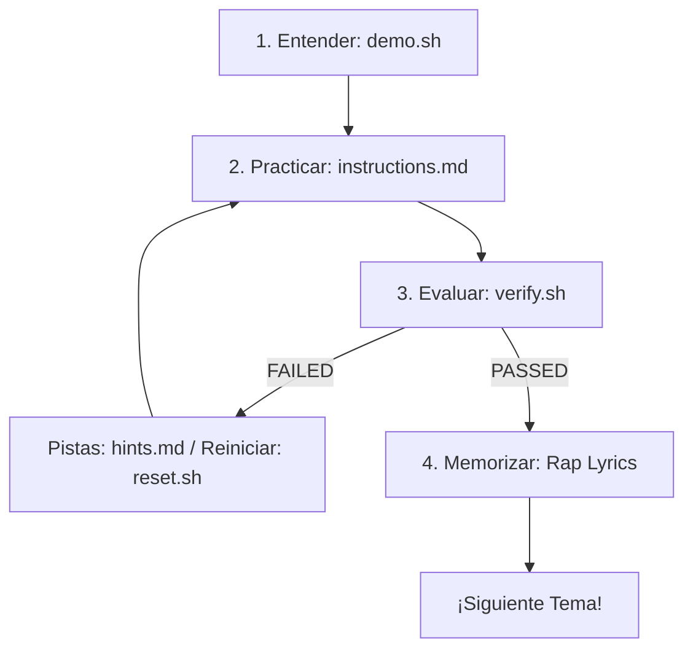

<div align="center">
<pre>
███████╗██╗  ██╗██████╗  ██████╗  ██████╗    ███████╗██╗      ██████╗ ██╗    ██╗ 
██╔════╝╚██╗██╔╝╚════██╗██╔═══██╗██╔═══██╗    ██╔════╝██║     ██╔═══██╗██║    ██║
█████╗   ╚███╔╝  █████╔╝██║   ██║██║   ██║    █████╗  ██║     ██║   ██║██║ █╗ ██║
██╔══╝   ██╔██╗ ██╔═══╝ ██║   ██║██║   ██║    ██╔══╝  ██║     ██║   ██║██║███╗██║
███████╗██╔╝ ██╗███████╗╚██████╔╝╚██████╔╝    ██║     ███████╗╚██████╔╝╚███╔███╔╝
╚══════╝╚═╝  ╚═╝╚══════╝ ╚═════╝  ╚═════╝    ╚═╝     ╚══════╝ ╚═════╝  ╚══╝╚══╝  
                        ██╗      ██████╗ ██████╗ ███████╗                        
                        ██║     ██╔══██╗██╔══██╗██╔════╝                         
                        ██║     ███████║██████╔╝███████╗                         
                        ██║     ██╔══██║██╔══██╗╚════██║                         
                        ███████╗██║  ██║██████╔╝███████║                         
                        ╚══════╝╚═╝  ╚═╝╚═════╝ ╚══════╝                         
</pre>
</div>
<p align="center">
  <a href="https://www.redhat.com/en/services/training/ex200-red-hat-certified-system-administrator-exam">
    
  </a>
  <a href="https://rockylinux.org/">
    
  </a>
  <a href="https://www.vagrantup.com/">
    
  </a>
  <a href="https://github.com/github/spec-kit">
    
  </a>
</p>

> **"Con la rima en la mente y los comandos en la shell, pasar el EX200 se vuelve un nivel fácil de vencer."**

`ex200-flow-labs` es un entorno interactivo y automatizado de aprendizaje diseñado en español para dominar el examen **Red Hat Certified System Administrator (RHCSA EX200)** basado en **Red Hat Enterprise Linux 9 (RHEL 9)**. 

Este proyecto utiliza **Vagrant con Hyper-V** para ofrecer laboratorios rápidos y aislados, y añade un enfoque mnemotécnico único: **canciones de rap técnico en español** para memorizar comandos complejos y sus flags específicos de forma divertida y permanente.

---

## ⚡ El Flujo de Estudio ("The Flow")

Cada laboratorio cuenta con una metodología estricta de cinco pasos estructurada bajo principios de desarrollo ágil:



1.  **`demo.sh` (La Demo Visual):** Corre el script de tutorial animado dentro de la VM para ver los comandos en acción.
2.  **`instructions.md` (El Reto):** Lee las directrices del challenge redactadas en español (pero conservando comandos en inglés).
3.  **`verify.sh` (El Validador):** Ejecuta el validador automatizado para autoevaluar tu entrega. Te dará un reporte visual de `PASSED`/`FAILED` sin alterar tus configuraciones.
4.  **`reset.sh` (El Reinicio):** ¿Cometiste un error crítico? Ejecuta el reset para limpiar la práctica y volver a empezar.
5.  **`hints.md` (Las Pistas):** Consulta pistas progresivas si te encuentras estancado.

---

## 📊 Tabla de Progreso y Hoja de Ruta (Cobertura 100%)

| Módulo | Tema del Examen | Estado del Lab | Especificación | Enlace al Lab | Rap Lyrics |
| :---: | :--- | :---: | :---: | :---: | :---: |
| **01** | Herramientas Esenciales e Inicio de Sesión | 📝 Planificación | [Ver Spec](file:///home/juanca/proys/RHCSA-EX200/specs/01-essential-tools/spec.md) | `labs/01-essential-tools/` | 📝 Planificado |
| **02** | Scripts de Automatización (Shell Scripting) | 📝 Planificación | [Ver Spec](file:///home/juanca/proys/RHCSA-EX200/specs/02-shell-scripting/spec.md) | `labs/02-shell-scripting/` | 📝 Planificado |
| **03** | Operación del Sistema (systemd, GRUB, root pass) | 📝 Planificación | [Ver Spec](file:///home/juanca/proys/RHCSA-EX200/specs/03-operating-systems/spec.md) | `labs/03-operating-systems/` | 📝 Planificado |
| **04** | Usuarios, Grupos, Permisos Especiales y ACLs | 📝 Planificación | [Ver Spec](file:///home/juanca/proys/RHCSA-EX200/specs/04-users-groups/spec.md) | `labs/04-users-groups/` | 📝 Planificado |
| **05** | Red (nmcli), Hostname, NTP (chrony) y Cron | 📝 Planificación | [Ver Spec](file:///home/juanca/proys/RHCSA-EX200/specs/05-networking-services/spec.md) | `labs/05-networking-services/` | 📝 Planificado |
| **06** | Seguridad de Red (firewalld) y SELinux | 📝 Planificación | [Ver Spec](file:///home/juanca/proys/RHCSA-EX200/specs/06-security-selinux/spec.md) | `labs/06-security-selinux/` | 📝 Planificado |
| **07** | Almacenamiento Local (LVM, Particiones, VDO) | 📝 Planificación | [Ver Spec](file:///home/juanca/proys/RHCSA-EX200/specs/07-local-storage/spec.md) | `labs/07-local-storage/` | 📝 Planificado |
| **08** | fstab, Almacenamiento en Red (NFS/SMB) y Autofs | 📝 Planificación | [Ver Spec](file:///home/juanca/proys/RHCSA-EX200/specs/08-filesystems-network/spec.md) | `labs/08-filesystems-network/` | 📝 Planificado |
| **09** | Contenedores con Podman (Rootless y Systemd) | 📝 Planificación | [Ver Spec](file:///home/juanca/proys/RHCSA-EX200/specs/09-podman-containers/spec.md) | `labs/09-podman-containers/` | 📝 Planificado |

---

## 🛠️ Configuración e Instalación Rápida (Paso a Paso)

Para que puedas correr estos laboratorios de forma local, utilizaremos un entorno mixto: **Windows 10/11** actuará como el hipervisor físico (mediante **Hyper-V**) y tu terminal de **WSL2 (Windows Subsystem for Linux)** servirá para controlar el despliegue del laboratorio sin tocar configuraciones manuales.

Sigue esta guía narrativa sencilla para preparar tu computadora en 10 minutos:

### 1. Activar Hyper-V en tu Windows
Hyper-V es la tecnología nativa de virtualización de Windows. Necesitamos activarla:
1. Abre el menú Inicio de Windows, escribe **PowerShell**, haz clic derecho sobre él y selecciona **Ejecutar como Administrador**.
2. Copia, pega y ejecuta el siguiente comando:
   ```powershell
   Enable-WindowsOptionalFeature -Online -FeatureName Microsoft-Hyper-V -All
   ```
3. Si el sistema te solicita reiniciar para aplicar los cambios, acepta y reinicia tu equipo.

### 2. Instalar Vagrant en Windows
Vagrant es la herramienta que creará y configurará la máquina virtual por nosotros:
1. Ve al sitio oficial de descargas de [Vagrant](https://www.vagrantup.com/downloads) y descarga el instalador para Windows (arquitectura AMD64/x86_64).
2. Ejecuta el instalador descargado y sigue el asistente haciendo clic en "Next" hasta finalizar.

### 3. Instalar Vagrant dentro de tu WSL2 (Linux)
Para que puedas controlar todo desde tu terminal de Linux, debemos instalar el ejecutable de Vagrant en WSL:
1. Abre tu terminal de WSL (por ejemplo, Ubuntu) y ejecuta los siguientes comandos para agregar el repositorio oficial de HashiCorp e instalar Vagrant:
   ```bash
   wget -O- https://apt.releases.hashicorp.com/gpg | gpg --dearmor | sudo tee /usr/share/keyrings/hashicorp-archive-keyring.gpg > /dev/null
   echo "deb [signed-by=/usr/share/keyrings/hashicorp-archive-keyring.gpg] https://apt.releases.hashicorp.com/ $(lsb_release -cs) main" | sudo tee /etc/apt/sources.list.d/hashicorp.list
   sudo apt update && sudo apt install vagrant
   ```

### 4. Enlazar Vagrant de WSL con el Motor de Windows
Dado que la máquina virtual real correrá en el Hyper-V de Windows, debemos decirle al Vagrant de WSL que tiene permiso para comunicarse con Windows:
1. Abre tu archivo de perfil en la terminal de WSL:
   ```bash
   nano ~/.bashrc
   ```
2. Desplázate hasta el final del archivo y añade esta línea:
   ```bash
   export VAGRANT_WSL_ENABLE_WINDOWS_ACCESS="1"
   ```
3. Guarda los cambios presionando `Ctrl+O`, luego `Enter` y sal con `Ctrl+X`.
4. Recarga tu terminal para activar el cambio:
   ```bash
   source ~/.bashrc
   ```

---

## 🚀 Cómo Iniciar y Usar el Laboratorio

Una vez realizada la instalación inicial, el uso diario es sumamente rápido:

### Paso A: Clonar el proyecto
Clona este repositorio en tu directorio de trabajo dentro de WSL:
```bash
git clone https://github.com/tu-usuario/ex200-flow-labs.git
cd ex200-flow-labs
```

### Paso B: Encender la Máquina Virtual
Inicia la máquina Rocky Linux 9 de estudio. Este comando creará la VM, le adjuntará un disco virtual de 10 GB para tus prácticas de almacenamiento, e instalará todo el software básico:
```bash
vagrant up --provider=hyperv
```
*(Nota: Al haber configurado la **Opción B de Copia Estática**, este comando no te pedirá ninguna credencial o contraseña de Windows host).*

### Paso C: Entrar a la Máquina de Estudio
Accede a la consola de la máquina virtual vía SSH:
```bash
vagrant ssh
```
Dentro de la máquina, podrás navegar al directorio `/labs/` donde encontrarás el laboratorio actual listo para ejecutar la demo o realizar el challenge.

> [!TIP]
> **Modificaciones de archivos y sincronización:**
> Como estamos usando la opción de copia estática segura para evitar fricción de contraseñas de red en Windows, si realizas algún cambio en las instrucciones o scripts desde WSL en el host, deberás sincronizar los archivos dentro de la VM ejecutando:
> ```bash
> vagrant provision
> ```

---

## 🎧 Mnemotecnia de Rap Técnico (Lyrics)

Como política de desarrollo e infraestructura, las letras de rap en español para cada tema **no se suben a este repositorio Git** para mantener limpio el entorno de código. Se guardan y gestionan de forma local en tu máquina host en el directorio externo `/home/juanca/RHCSA-EX200-lyrics/`.
