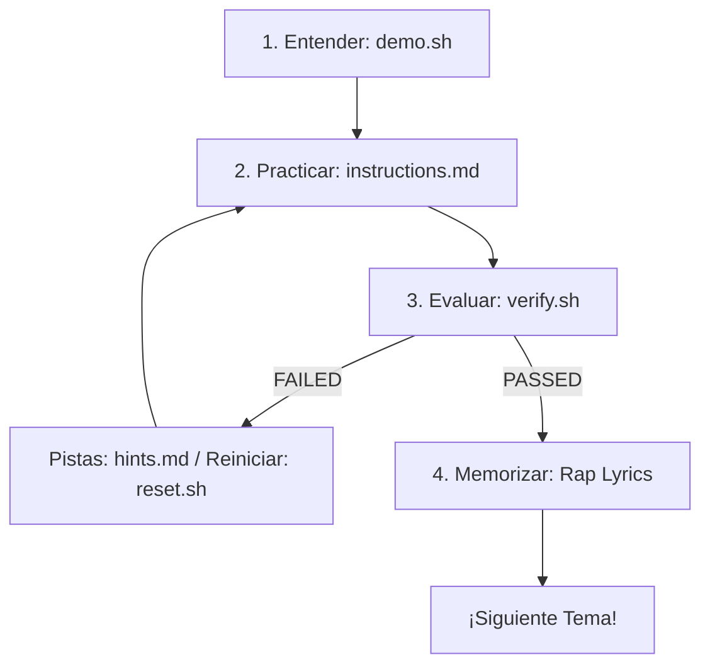

<div align="center">
<pre>
███████╗██╗  ██╗██████╗  ██████╗  ██████╗    ███████╗██╗      ██████╗ ██╗    ██╗ 
██╔════╝╚██╗██╔╝╚════██╗██╔═══██╗██╔═══██╗    ██╔════╝██║     ██╔═══██╗██║    ██║
█████╗   ╚███╔╝  █████╔╝██║   ██║██║   ██║    █████╗  ██║     ██║   ██║██║ █╗ ██║
██╔══╝   ██╔██╗ ██╔═══╝ ██║   ██║██║   ██║    ██╔══╝  ██║     ██║   ██║██║███╗██║
███████╗██╔╝ ██╗███████╗╚██████╔╝╚██████╔╝    ██║     ███████╗╚██████╔╝╚███╔███╔╝
╚══════╝╚═╝  ╚═╝╚══════╝ ╚═════╝  ╚═════╝    ╚═╝     ╚══════╝ ╚═════╝  ╚══╝╚══╝  
                        ██╗      ██████╗ ██████╗ ███████╗                        
                        ██║     ██╔══██╗██╔══██╗██╔════╝                         
                        ██║     ███████║██████╔╝███████╗                         
                        ██║     ██╔══██║██╔══██╗╚════██║                         
                        ███████╗██║  ██║██████╔╝███████║                         
                        ╚══════╝╚═╝  ╚═╝╚═════╝ ╚══════╝                         
</pre>
</div>
<p align="center">
  <a href="https://www.redhat.com/en/services/training/ex200-red-hat-certified-system-administrator-exam">
    
  </a>
  <a href="https://almalinux.org/">
    
  </a>
  <a href="https://www.vagrantup.com/">
    
  </a>
  <a href="https://github.com/github/spec-kit">
    
  </a>
</p>

> **"Con la rima en la mente y los comandos en la shell, pasar el EX200 se vuelve un nivel fácil de vencer."**

`ex200-flow-labs` es un entorno interactivo y automatizado de aprendizaje diseñado en español para dominar el examen **Red Hat Certified System Administrator (RHCSA EX200)** basado en **Red Hat Enterprise Linux 9 (RHEL 9)**. 

Este proyecto utiliza **Vagrant con Hyper-V** para ofrecer laboratorios rápidos y aislados, y añade un enfoque mnemotécnico único: **canciones de rap técnico en español** para memorizar comandos complejos y sus flags específicos de forma divertida y permanente.

---

## 📚 Temas Cubiertos en los Labs

Este entorno de laboratorios cubre el 100% de los objetivos oficiales del examen RHCSA (EX200):

1. **Herramientas Esenciales:** Consola, edición de archivos, comandos básicos y redirecciones.
2. **Scripts de Automatización:** Fundamentos y prácticas de Shell Scripting en Bash.
3. **Operación del Sistema:** Control de servicios con systemd, GRUB y recuperación de contraseña de root.
4. **Usuarios y Grupos:** Gestión de identidades, permisos especiales (SUID, SGID, Sticky Bit) y ACLs.
5. **Servicios de Red:** Configuración con nmcli, sincronización de hora con chrony y tareas programadas con Cron.
6. **Seguridad y SELinux:** Gestión de firewalld y modos, contextos y políticas de SELinux.
7. **Almacenamiento Local:** Gestión de particiones, volúmenes lógicos (LVM) y optimización.
8. **Sistemas de Archivos en Red:** Montajes estáticos en `/etc/fstab`, NFS, SMB y montajes dinámicos con Autofs.
9. **Contenedores:** Despliegue de contenedores Rootless y persistencia de servicios mediante systemd con Podman.

---

## ⚡ El Flujo de Estudio ("The Flow")

Cada laboratorio cuenta con una metodología estricta de cinco pasos estructurada bajo principios de desarrollo ágil:



1.  **`demo.sh` (La Demo Visual):** Corre el script de tutorial animado dentro de la VM para ver los comandos en acción.
2.  **`instructions.md` (El Reto):** Lee las directrices del challenge redactadas en español (pero conservando comandos en inglés).
3.  **`verify.sh` (El Validador):** Ejecuta el validador automatizado para autoevaluar tu entrega. Te dará un reporte visual de `PASSED`/`FAILED` sin alterar tus configuraciones.
4.  **`reset.sh` (El Reinicio):** ¿Cometiste un error crítico? Ejecuta el reset para limpiar la práctica y volver a empezar.
5.  **`hints.md` (Las Pistas):** Consulta pistas progresivas si te encuentras estancado.

---

## 🚀 Guía de Inicio Rápido (Paso a Paso)

Sigue este flujo cronológico ordenado para configurar tu entorno y ejecutar tu primer laboratorio en menos de 10 minutos.

### Paso 1: Clonar el proyecto
Primero, abre la terminal de **PowerShell** en tu Windows 10/11 y clona este repositorio en un directorio local de tu disco físico (por ejemplo, `C:\proys\`):
```powershell
# Nota: Requiere tener Git para Windows instalado
git clone https://github.com/hooperits/ex200-flow-labs.git
cd ex200-flow-labs
```

### Paso 2: Activar Hyper-V en Windows
Hyper-V es la tecnología nativa de virtualización de Windows. Para activarla:
1. Con la consola de **PowerShell** aún abierta, asegúrate de ejecutarla con privilegios de **Administrador**.
2. Copia y ejecuta el siguiente comando:
   ```powershell
   Enable-WindowsOptionalFeature -Online -FeatureName Microsoft-Hyper-V -All
   ```
3. Si el sistema te solicita reiniciar para aplicar los cambios, acepta y reinicia tu equipo.

### Paso 3: Instalar Vagrant
Vagrant creará y gestionará la máquina virtual de forma automática:
1. Descarga el instalador oficial de [Vagrant para Windows](https://www.vagrantup.com/downloads) (arquitectura AMD64/x86_64).
2. Ejecuta el archivo descargado y completa el asistente haciendo clic en "Next" hasta finalizar.

### Paso 4: Encender la Máquina Virtual
Para evitar ingresar tu cuenta personal de Windows (o si inicias sesión con PIN y no recuerdas tu contraseña), crearemos un usuario local auxiliar en Windows exclusivo para la compartición de archivos del laboratorio:

1. Abre tu terminal de **PowerShell** con privilegios de **Administrador** (requerido por Hyper-V).
2. Crea el usuario local `vagrantlabs` ejecutando los siguientes dos comandos:
   ```powershell
   net user vagrantlabs MiPasswordSeguro123 /add
   net localgroup Administradores vagrantlabs /add
   ```
3. Inicia la máquina virtual de estudio (AlmaLinux 9) ejecutando:
   ```powershell
   vagrant up --provider=hyperv
   ```

> [!IMPORTANT]
> **1. Selección del Switch Virtual en Hyper-V**:
> Durante el arranque, Vagrant te solicitará elegir un **Virtual Switch** (Switch Virtual). 
> * **Recomendación**: Elige el número de opción correspondiente a **`Default Switch`**.
> * **Por qué**: Este switch interno de Windows viene preconfigurado con asignación de IP automática (DHCP) y traducción de red (NAT), lo que asegura que tu máquina virtual obtenga salida a Internet para el aprovisionamiento y que Vagrant pueda comunicarse con ella vía SSH.

> [!NOTE]
> **2. Credenciales de Windows (SMB)**:
> Al montar las carpetas, Vagrant te pedirá un usuario y contraseña. Utiliza la cuenta de servicio local que acabas de crear:
> * **Username (usuario)**: `vagrantlabs`
> * **Password (contraseña)**: `MiPasswordSeguro123`
> *(Nota: Vagrant no almacena tus credenciales en ningún sitio; solo las pasa localmente a Windows para autorizar el montaje de la carpeta de red hacia la VM).*


### Paso 5: Acceder a la VM y Ejecutar el Lab
1. Conéctate a la consola de la máquina virtual vía SSH:
   ```powershell
   vagrant ssh
   ```
2. Dentro de la máquina (que es un entorno Linux puro de AlmaLinux 9), navega al directorio del laboratorio y entra en el módulo que desees practicar (por ejemplo, el módulo 01):
   ```bash
   cd /labs/01-essential-tools/
   ```
3. Ejecuta la demostración animada en español para ver los comandos en acción:
   ```bash
   ./demo.sh
   ```
4. Lee las instrucciones del reto práctico:
   ```bash
   cat instructions.md
   ```
5. Realiza los cambios necesarios en el subdirectorio `challenge/` para resolver el reto (puedes ver pistas progresivas con `cat hints.md`).
6. Valida si tu solución es correcta ejecutando el validador automático no destructivo:
   ```bash
   ./verify.sh
   ```
7. Si deseas volver a practicar desde cero, limpia el entorno ejecutando:
   ```bash
   ./reset.sh
   ```

> [!TIP]
> **Sincronización de Archivos**:
> Si realizas cambios en las instrucciones o scripts de la carpeta `./labs/` en el host (Windows) con tu editor de código (como VS Code), puedes sincronizarlos con la máquina virtual en cualquier momento ejecutando desde PowerShell en Windows:
> ```powershell
> vagrant provision
> ```
